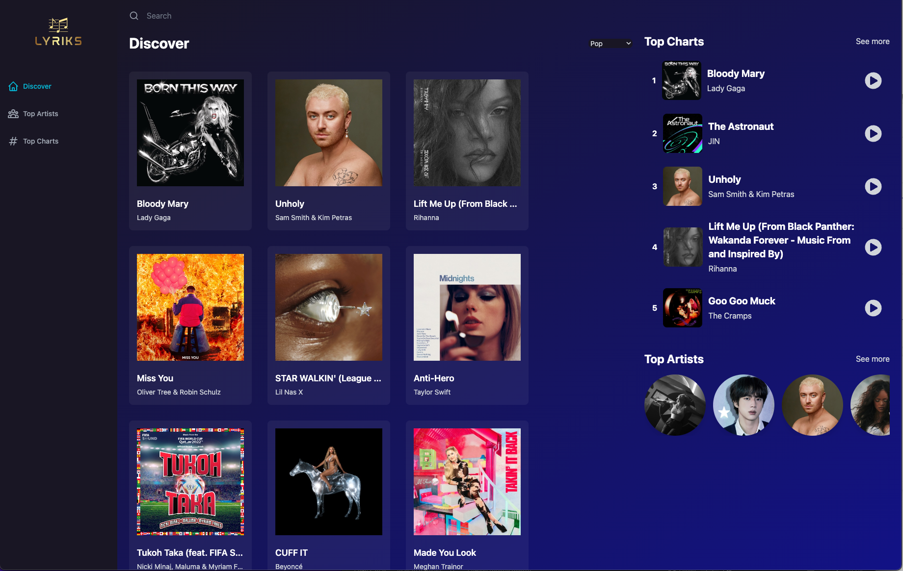

# Hi, I'm Pradip! 👋

## 🚀 About Me

I'm a full stack Javascript Developer...

## 🔗 Links

## About The Project

✅ This is the music application which is a online music platform for listening music

Key Features:

- User can choose a genre and get the top songs for that genre along with the list of most famous artists songs
- Users can click on any song, and a music player will appear. The player includes basic controls such as the previous song, the next song, and pause/play buttons. Additional details such as the song’s name, author, volume, repeat, and duration controls appears.
- Users can start typing artists or song names, and results based on their search will show up.
- Users can see additional information about the song, such as the song’s music lyrics and a list of similar songs.
- Maintained clean code and uses as many React best practices as possible.

## 👨🏻‍💻 Technologies used:

- Vite Js, Redux Axios, Swiper Js, Shazam Core API

## Screenshots

---

